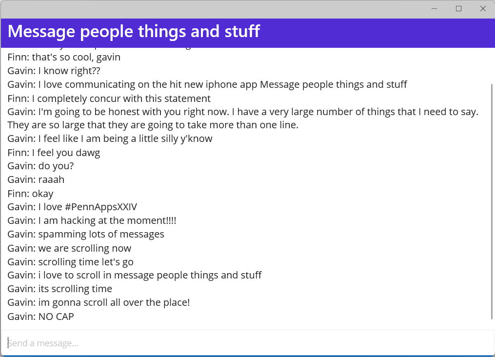

# msnmsg
*#PennAppsXXIV*

A recreation of old school messenger programs like MSN messenger or AOL messenger.

## Table of Contents
* [Inspiration](#inspiration)
* [What it does](#what-it-does)
* [How we built it](#how-we-built-it)
* [Challenges we ran into](#challenges-we-ran-into)
* [Accomplishments that we're proud of](#accomplishments-that-were-proud-of)
* [What we learned](#what-we-learned)
* [What's next for msnmsg](#whats-next-for-msnmsg)

## Inspiration
MSN Messenger and AOL messenger

## What it does
A messaging app where you can easily talk to friends. Just open the app, and you're instantly able to talk to them.

## How we built it
We built this app using C#, ASP.NET, MAUI, and gRPC. There are two parts to the program, an ASP.NET server that receives messages and sends them to other users. The other part of this program is the client, written using MAUI. It allows users to send and receive messages easily, abstracting away the technical details.

## Challenges we ran into
* We had issues getting the protocol buffers and services to generate definitions
* We had a lot of trouble creating a MAUI project in .NET, because there's a lot of conflicting information online about it
* We had trouble debugging exceptions because sometimes they wouldn't be printed to the console
* We had problems with connecting gRPC to the ASP.NET server

## Accomplishments that we're proud of
We are very proud that we finished this project before the deadline. We faced many challenges and at some points we had no idea if it was going to work or not. We created a distributed architecture where a very large number of clients could connect to the server and start chatting.

## What we learned
We learned how to us gRPC, ASP.NET, and MAUI.

## What's next for msnmsg
We plan to create msnmsg mobile apps for both iOS and Android. We also plan to add a Twilio integration for authentication via SMS messages.